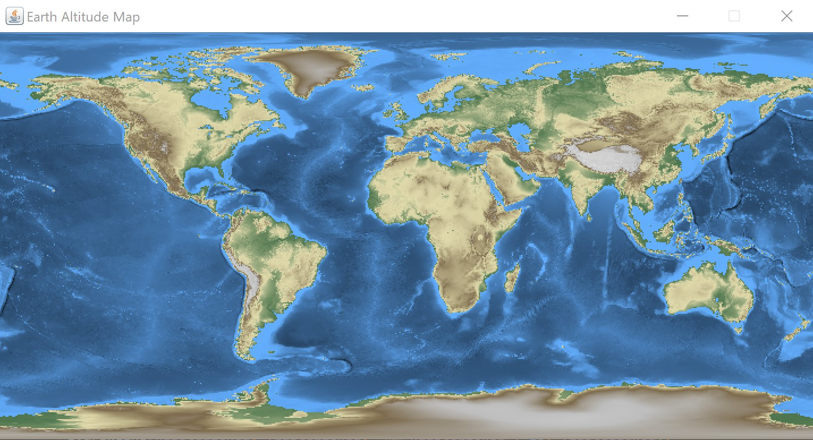
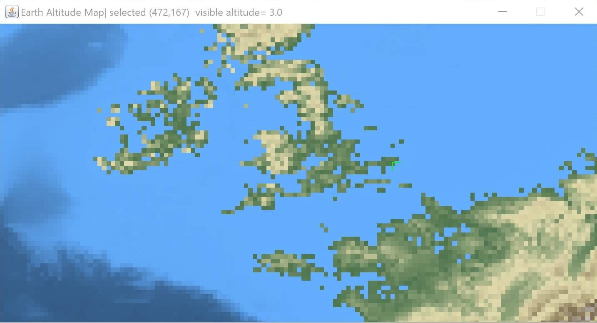

# CE152-4
## Why?
This repo is me learning Java. The main package is the assignment package, which is the final parctical test of the year.

## What?
The task is to create a map of world given .xzy file full of coordinates and their corresponding altitudes. The whole thing is basically a color coded scatter plot. The point of this exercise is to be able to see the possible effects of global warming and to raise awareness amongst the students. Which I have accomplished, sort of. This primitive models definitely shows you which areas would be hit first. 

## How?
Go ahead and give it a try, if you were Noah, what place would be your best bet? 

One is able to select a certain point via mouse click, view its true altitude with respect to the sea level in the top bar. You can also see how much of the land disapears and reapears by affecting the sea level with your mouse wheel. As a bonus I have decided to add zooming and panning. 

